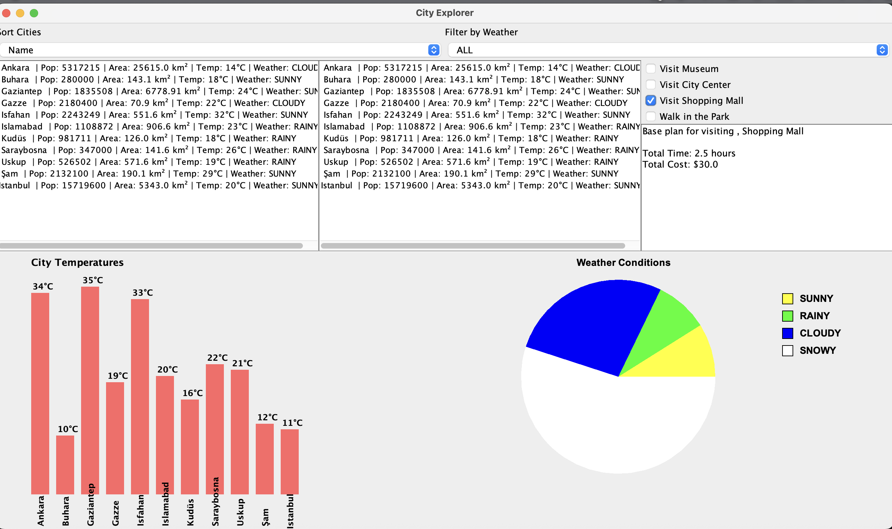
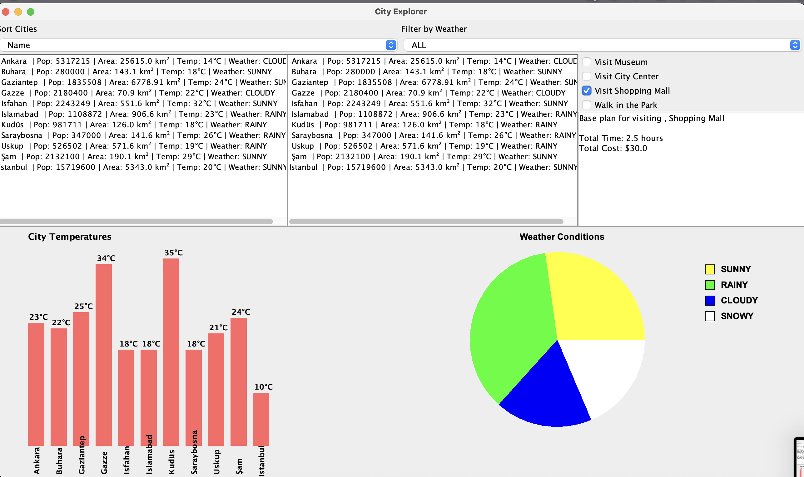
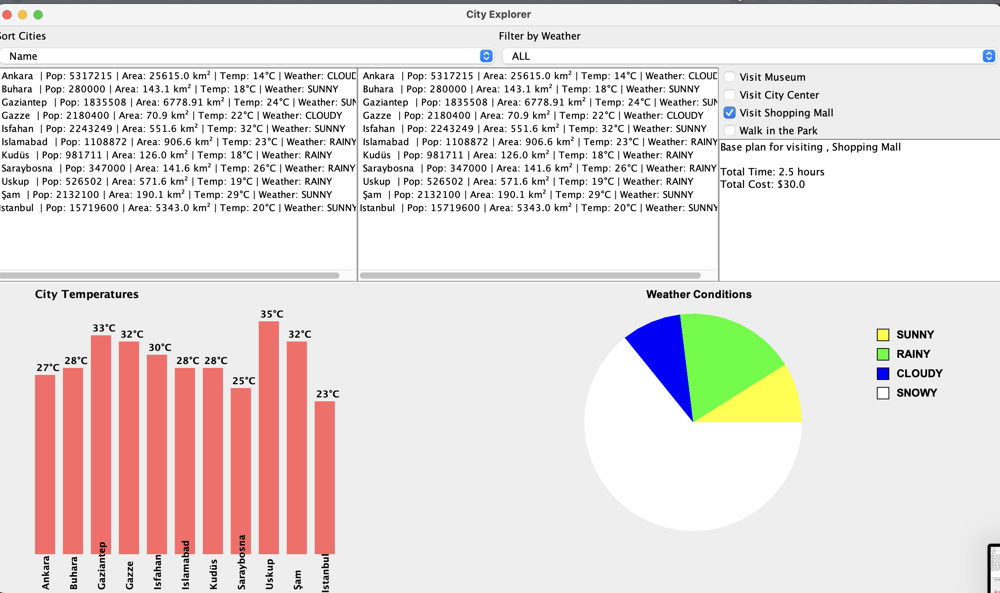

# Java City Explorer & Weather Tracker

A robust Java Swing application that manages city data from JSON files, visualizes weather statistics through dynamic charts, and implements core software design patterns.

## 🚀 Key Features
* **Dynamic Data Management:** City information is efficiently loaded from `cities.json` using the **Singleton Pattern**.
* **Real-time Updates:** City temperatures and charts refresh automatically every 3 seconds to simulate live data tracking.
* **Advanced Filtering:** Users can filter cities by name, population, or weather conditions (Sunny, Rainy, etc.) in real-time.
* **Activity Planner:** Add activities (Museum, Mall, Park) to selected cities. Total costs and time are calculated using the **Decorator Pattern**.
* **Visual Analytics:** Features a Bar Chart for temperature comparisons and a Pie Chart for weather condition distributions.

## 📸 Screenshots

### Main Dashboard & Statistics
The primary interface showing the city list and dynamic data visualization charts.

### Filtering & Search
Real-time filtering based on specific weather conditions and city criteria.

### Trip Planning & Decorators
Activity selection interface where time and cost are dynamically calculated.

## 🛠️ Tech Stack & Design Patterns
* **Language:** Java (Swing & AWT)
* **Data Format:** JSON (processed via `org.json` library)
* **Design Patterns:** Singleton, Decorator, Strategy
* **Dependencies:** `json-20240303.jar`

## ⚙️ Installation & Setup
1. Clone this repository to your local machine.
2. Add the `libs/json-20240303.jar` file to your project's **Referenced Libraries**.
3. Ensure `cities.json` is located in the root directory.
4. Run `Main.java` to start the application.
